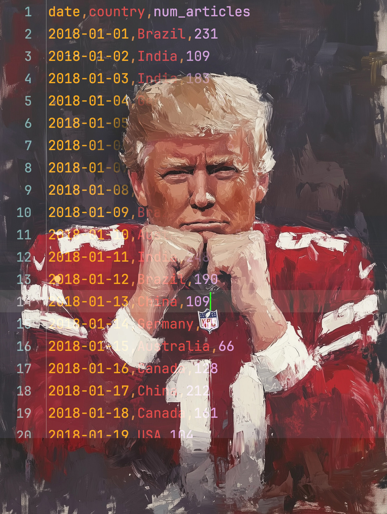

# BuddyCall-Plotly

## 🖼 Teams
<div style="display: flex; justify-content: space-around;">
  
  
</div>

## 📌 Projektbeschreibung
Dieses Projekt enthält ein interaktives **Daten-Dashboard**, das zwei verschiedene Visualisierungen darstellt:


🔹 **Team Trump:** Weltweite Medienberichterstattung über Trump als Bubble Map  
🔹 **Team Musk:** Entwicklung von Themen-Trends über Zeit als Liniendiagramm  

## 🐍 Python Libraries Introduction
 🗒️ [**Pandas** intro lesson](https://drive.google.com/file/d/1UQs7scnP_cJNBlIN_CapHjI33zh38L7v/view?usp=sharing)
 
 👠️ [**Pandas** advanced lesson](https://drive.google.com/file/d/11FykZnsldSWWBPo-ynOnLvTlxpywR7be/view?usp=sharing)

 🩸 [**Pandas melted lesson](https://drive.google.com/file/d/1bxwVaKr9pkj05WJzwP3qUjr8bXNhr3bR/view?usp=sharing)

 📊 [**Plotly** Bar Charts intro course](https://drive.google.com/file/d/168oi01hns75GOSUy-qkwudrQDH18Fp1K/view?usp=sharing)

 🌏 [**Plotly** Bubble Maps intro course](https://drive.google.com/file/d/1lTe_Mo8nkvTuL3D-2Ntx6HgOQBEG-wxx/view?usp=sharing)

## 📥 Installation
1. Klone das Repository oder lade es als ZIP herunter.
2. Installiere die benötigten Pakete:
   ```bash
   pip install -r requirements.txt
   ```
3. Führe das Dashboard aus:
   ```bash
   python main.py
   ```

## 🛠 Struktur
- **data/** → CSV-Daten für Trump & Musk
- **visuals/** → Code für die Visualisierungen (`trump.py`, `musk.py`)
- **exercises/** → Übungen für Pandas & Plotly
- **main.py** → Das Haupt-Dashboard mit Asciimatics-Animation

## 🎯 Steuerung
- **Q** → Beenden

Viel Spaß mit der Visualisierung! 🚀
